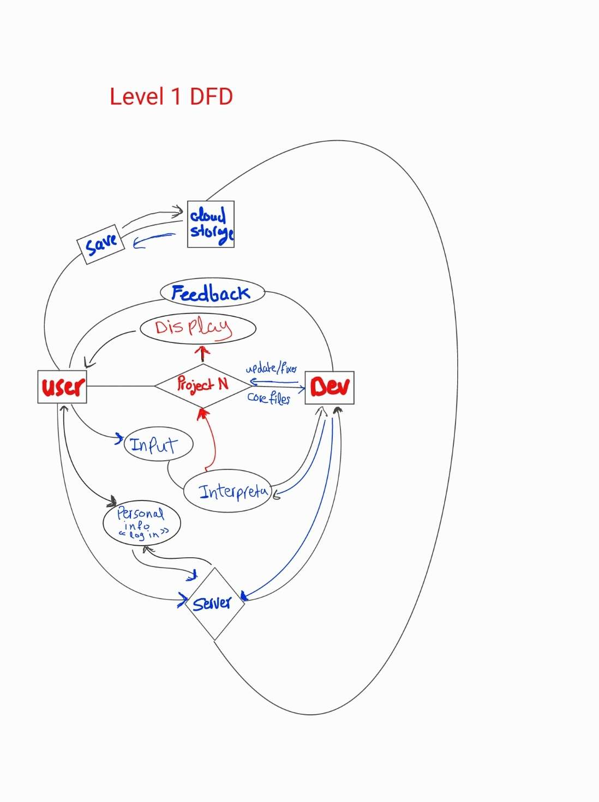
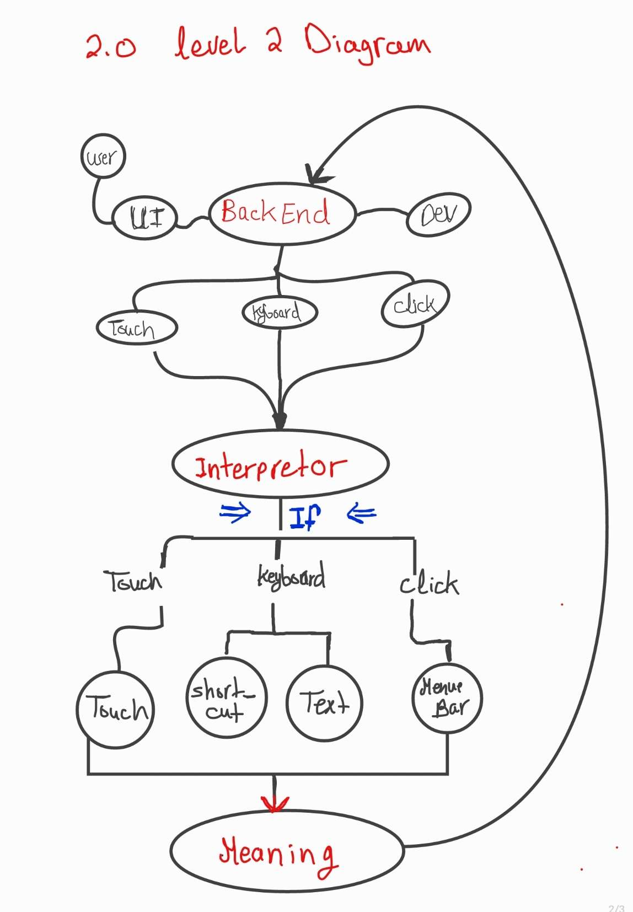

# Design Document projectN

## Team Project Name and Info

#### Our project name:  

projectN

#### Our team’s name:  

MMM

#### Our team members:  

Yulia Bobkova  
Saksham Singh Sohal  
Santiago Daza  
Vladimir Zhelev  

#### Primary contact:  

Yulia Bobkova  
yulia.anna.bobkova@gmail.com

## Table of Contents

- #### Under maintenance 

## Design Overview

The above represents the DFD Level 0. In this, the most basic interaction.

Developers

* Our team

projectN

* This is our web app

User 
* The note taker

**Developer Links**

- updates, any bug fixes or major changes
- user profile, any setting changes, ribbon customizability, theme changes, typing mode changes, account settings
- output, user input goes into projectN and outputs to us, the developers
- all above is saved into the database

**User Links**

- formatting tools, user is given a set of text formatting tools to use 
- blank page, user is given a blank page to put their output onto
- settings, give the user customizability options for their account, ribbons, theme, view mode ect.

## Logical Design

Our approach primarily focuses on system decomposition, data flow diagrams, and the main system components. The central elements of our approach include system decomposition, data flow diagrams, linking system elements and interactions, and capturing functionality. This approach guides us through the subsystems during the decomposition phase. We subsequently create data flow diagrams to address specific aspects, ensuring that our design comprehensively encompasses all of the product's functionality and the necessary requirements for the initial version. Additionally, we have incorporated logical implementations for certain features, which would be beneficial in the later stages of the project.

### Decomposition

We have considered the following subsystem:

- #### Product Feature Subsystem:

Purpose: Handle the core features and functionalities of  the application.
Functionality: Implement and manage the key features outlined in the product overview, including note-taking, knowledge-testing, synchronization, offline access, search, indexing, and more.

- #### User Interface Subsystem:

Purpose: Manage the user interface and visual aspects of the application.

Functionality: Design, layout, and control the appearance and behavior of the app's user interface, including taskbars, themes, fonts, and user customization options.

Components: This subsystem can encompass various components responsible for rendering the user interface elements and ensuring a user-friendly and visually appealing experience.

- #### Cloud Integration Subsystem:

Purpose: Explore integration with cloud services for data storage and backup.

Functionality: Allow users to access their data from different devices.

- #### Search and indexing Subsystem:

Purpose: Provide quick retrieval of notes.

Functionality: Implement a search feature and indexing system for efficient content retrieval.

- #### Synchronization Subsystem:(optional)

Purpose: Enable syncing of data across multiple devices.
Functionality: Sync notes and quiz data between the web app and other platforms (iOS, Windows).

- #### Offline Accessibility Subsystem:

-Purpose: Ensure the app can be used without an internet connection.
Functionality: Enable users to access and edit their notes and quizzes offline.

- #### Note-Taking Subsystem:

Purpose: Handle the core note-taking functionality.

Functionality: Create, edit, format, and save notes. Implement the Markdown formatting.

- #### User Management Subsystem:

Purpose: Manage user accounts, authentication, and authorization.

Functionality: User registration, login, profile management, and permission control.

- #### Knowledge-Testing Subsystem:

Purpose: Manage knowledge-testing tools and quizzes.

Functionality: Create, edit, and take quizzes based on notes. Track and display quiz results.

The above represents the DFD Level 1. zooming into more detais;

### Inupt-output streams, cloud integration sub-system, User mangment sub-system

1. User -> Input -> Interpreter -> Project N -> Display ->User (User <--> Display)
2. User -> personal info -> server ( User <--> Server)
3. User -> feedbcak -> Developers (indirect interaction: User <--> Developers)

(The process between Interpreter and developer described in level 2 DFD)

This diagram explains the role of the interpreter based on the conditions that apply to the input!

Beginning of the processing data, analytical stage, prepare to explain the level 2.1 DFD diagram.

### Product Feature Subsystem, Note-Taking Subsystem, Inupt-output streams

RenderThis diagram provides in-depth details about data processing, serving as an extension of the Level 2 DFD. Data processing is organized around three chosen classes:

1. Page, 
2. Menus, 
3. Account.

From these classes, the application will be able to generate objects based on these classes!

Each of these objects will encompass distinct features and functionality in alignment with the specific requirements. Additionally, each feature is associated with performing actions to do what is required.

## Physical Design

For the most part, we are using Google standards for the physical design of the structure.

### Programming language(s) and any supporting tools to be used

- In the beginning phases of the projectN, Vanilla JavaScript will be used, aiming to integrate the next.js framework as the project progresses.
- HTML
- For the style we are using CSS with the extension Sassy CSS (SCSS).
- An external server to host. 

### Directory and File Naming Structure to be Used Within the Code Repository

According to Google Style, file names must be all lowercase and may include underscores (_) or dashes (-), but no additional punctuation.

### File Structure

#### 01_documentation

This folder contains all necessary documentation regarding functionality, standards and other relevant information. 

#### 02_programm_projectN

##### Assets

This folder contains all the subfolders containing all the graphical interface assets:

- Fonts
- Images
- Icons
- Styles

##### Components

This folders contains all the subfolders for functionality:

- Buttons
- navbar
- hover menus
- main menus
- errors

##### back_end

This folder is split in two, there is "helpers" & "features". "features" has sub directories that contains different features that will run the actual program. "helpers" is going to contain all the basic programs to perform small tasks that might be called by multiple files. 

### Implementation method for each shared data store (database, file, etc)
(including format, fields, layout)

### interface for all public services provided by the element:

- publicly accessible data types and constants
- publicly callable function names, return types, parameter lists
- class names, public field names/types, public method names, parameters, return types

